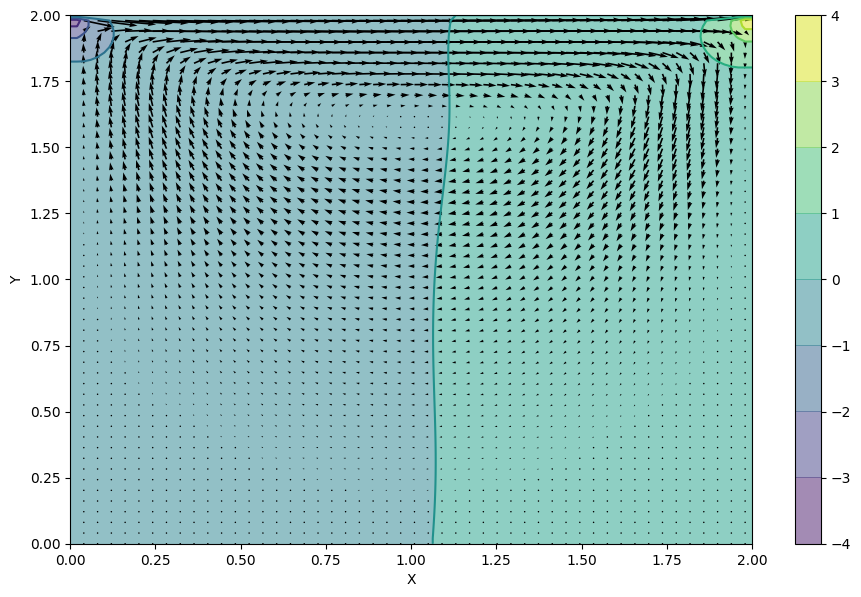

**Cavity Flow with Navier–Stokes**
=====
***

**C++ result**
--

The C++ code can be found in the folder **navier-stokes**.


```python
from numpy import genfromtxt
from matplotlib import pyplot
from matplotlib import cm
import numpy
nx = 100
ny = 100
```

### **No parallelization**

This is the result of the implementation of the Navier-Stokes equation in c++. This code is essentially the provided python code translated to c++.

#### Run
$ g++ navier-stokes-cavity.cpp
$ ./a.out
#### Result


```python
ucpp = genfromtxt('navier-stokes/result/u.csv', delimiter=',')
vcpp = genfromtxt('navier-stokes/result/v.csv', delimiter=',')
pcpp = genfromtxt('navier-stokes/result/p.csv', delimiter=',')
```


```python
x = numpy.linspace(0, 2, nx)
y = numpy.linspace(0, 2, ny)
X, Y = numpy.meshgrid(x, y)

fig = pyplot.figure(figsize=(11,7), dpi=100)
# plotting the pressure field as a contour
pyplot.contourf(X, Y, pcpp, alpha=0.5, cmap=cm.viridis)  
pyplot.colorbar()
# plotting the pressure field outlines
pyplot.contour(X, Y, pcpp, cmap=cm.viridis)  
# plotting velocity field
pyplot.quiver(X[::2, ::2], Y[::2, ::2], ucpp[::2, ::2], vcpp[::2, ::2]) 
pyplot.xlabel('X')
pyplot.ylabel('Y');
```


#### Computation time


```python
f = open('navier-stokes/result/milliseconds', 'r')
time = f.read()
print (time + " milliseconds")
f.close()
```

    7928 milliseconds


### **OpenMP**

This is the result of extending the above code with OpenMP. Most of the for-loops, which represent matrix operations can be parallized. To add the parallelization, "#pragma omp parallel for" has been added above the for-loops.

#### Run
$ g++ navier-stokes-cavity-openmp.cpp -fopenmp
$ ./a.out
#### Result


```python
ucpp_openmp = genfromtxt('navier-stokes/result/u-openmp.csv', delimiter=',')
vcpp_openmp = genfromtxt('navier-stokes/result/v-openmp.csv', delimiter=',')
pcpp_openmp = genfromtxt('navier-stokes/result/p-openmp.csv', delimiter=',')
```


```python
x = numpy.linspace(0, 2, nx)
y = numpy.linspace(0, 2, ny)
X, Y = numpy.meshgrid(x, y)

fig = pyplot.figure(figsize=(11,7), dpi=100)
# plotting the pressure field as a contour
pyplot.contourf(X, Y, pcpp_openmp, alpha=0.5, cmap=cm.viridis)  
pyplot.colorbar()
# plotting the pressure field outlines
pyplot.contour(X, Y, pcpp_openmp, cmap=cm.viridis)  
# plotting velocity field
pyplot.quiver(X[::2, ::2], Y[::2, ::2], ucpp_openmp[::2, ::2], vcpp_openmp[::2, ::2]) 
pyplot.xlabel('X')
pyplot.ylabel('Y');
```


```python
f = open('navier-stokes/result/milliseconds-openmp', 'r')
time = f.read()
print (time + " milliseconds")
f.close()
```

    2 milliseconds


### **MPI**

This is the result of extending the original c++ code with MPI. The implementation broadcasts the following data:

\- matrix b: at the end of function __build_up_b()__

\- matrix p: every iteration in the first loop of function __pressure_poisson()__

\- matrix u and v: every iteration in the first loop of __cavity_flow()__

This ensures that, when matrix b, p, or u is used for another calculation (occurs on the left-hand side of an assignment), then the values are up to date in each process.

#### Run
$ mpicxx navier-stokes-cavity-mpi.cpp
$ mpirun -np 2 a.out
#### Result


```python
ucpp_mpi = genfromtxt('navier-stokes/result/u-mpi-2.csv', delimiter=',')
vcpp_mpi = genfromtxt('navier-stokes/result/v-mpi-2.csv', delimiter=',')
pcpp_mpi = genfromtxt('navier-stokes/result/p-mpi-2.csv', delimiter=',')
```


```python
x = numpy.linspace(0, 2, nx)
y = numpy.linspace(0, 2, ny)
X, Y = numpy.meshgrid(x, y)

fig = pyplot.figure(figsize=(11,7), dpi=100)
# plotting the pressure field as a contour
pyplot.contourf(X, Y, pcpp_mpi, alpha=0.5, cmap=cm.viridis)  
pyplot.colorbar()
# plotting the pressure field outlines
pyplot.contour(X, Y, pcpp_mpi, cmap=cm.viridis)  
# plotting velocity field
pyplot.quiver(X[::2, ::2], Y[::2, ::2], ucpp_mpi[::2, ::2], vcpp_mpi[::2, ::2]) 
pyplot.xlabel('X')
pyplot.ylabel('Y');
```





```python
f = open('navier-stokes/result/milliseconds-mpi-2', 'r')
time = f.read()
print (time + " milliseconds")
f.close()
```

    5 milliseconds


#### Run
$ mpicxx navier-stokes-cavity-mpi.cpp
$ mpirun -np 4 a.out
#### Result


```python
ucpp_mpi = genfromtxt('navier-stokes/result/u-mpi-4.csv', delimiter=',')
vcpp_mpi = genfromtxt('navier-stokes/result/v-mpi-4.csv', delimiter=',')
pcpp_mpi = genfromtxt('navier-stokes/result/p-mpi-4.csv', delimiter=',')
```


```python
x = numpy.linspace(0, 2, nx)
y = numpy.linspace(0, 2, ny)
X, Y = numpy.meshgrid(x, y)

fig = pyplot.figure(figsize=(11,7), dpi=100)
# plotting the pressure field as a contour
pyplot.contourf(X, Y, pcpp_mpi, alpha=0.5, cmap=cm.viridis)  
pyplot.colorbar()
# plotting the pressure field outlines
pyplot.contour(X, Y, pcpp_mpi, cmap=cm.viridis)  
# plotting velocity field
pyplot.quiver(X[::2, ::2], Y[::2, ::2], ucpp_mpi[::2, ::2], vcpp_mpi[::2, ::2]) 
pyplot.xlabel('X')
pyplot.ylabel('Y');
```


```python
f = open('navier-stokes/result/milliseconds-mpi-4', 'r')
time = f.read()
print (time + " milliseconds")
f.close()
```

    4 milliseconds

